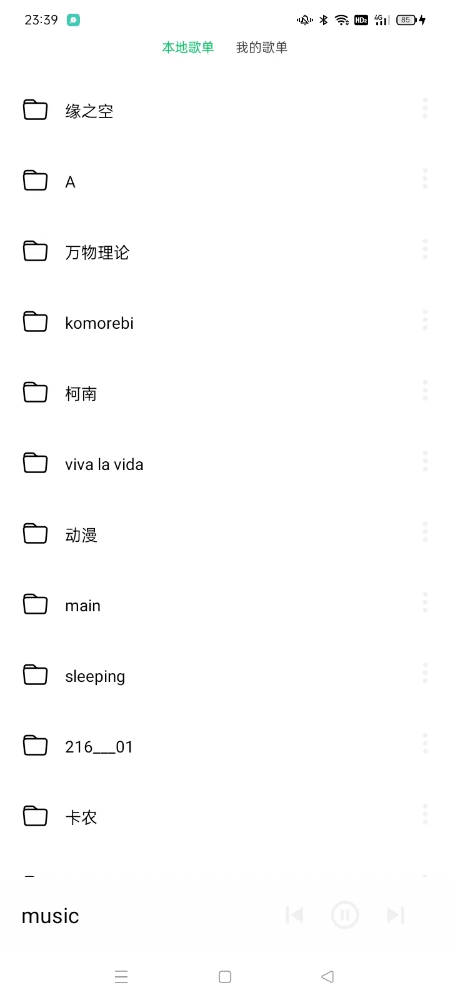
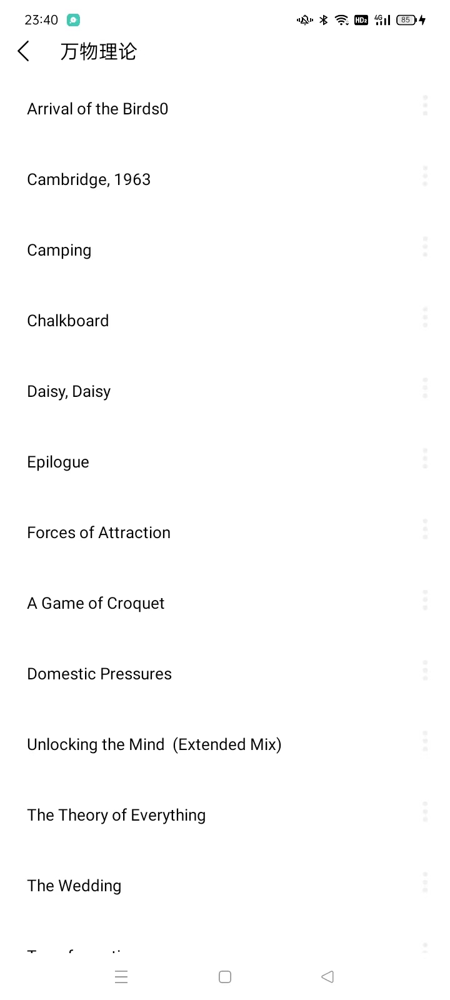
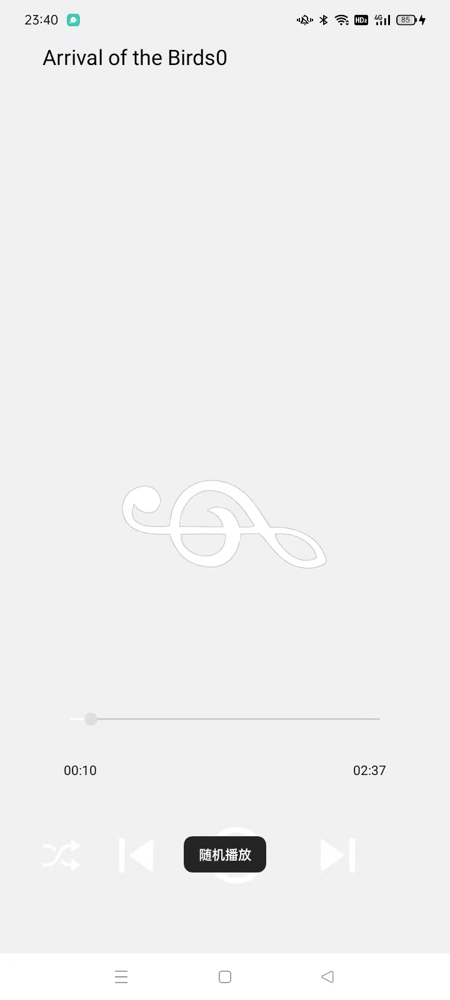

基于该项目修改：https://github.com/bimalkaf/Android_Basic_MusicApp

# PristinePlayer

厌倦了某云音乐，没用的功能太多，广告太多。于是打算写一个纯粹的，原始的音乐播放器。

# 功能

1、读取手机所有音乐，音乐所处的第一父文件夹作为本地歌单。

2、正常音乐播放，可设置播放模式。

# TODO

1、新建歌单

2、将歌曲加入歌单和从中移除。

3、耳机线控播放。

4、根据关键字搜索歌曲。

5、若之后有空，对接音乐服务器，实现流媒体播放。

# 效果图

